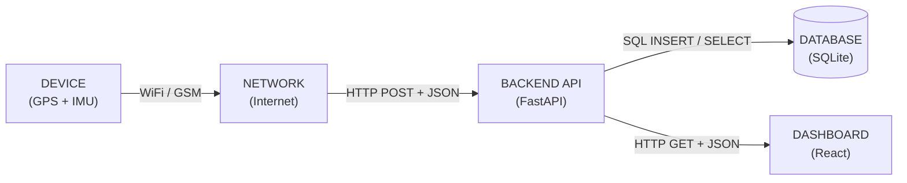

# Full Stack Starter Task - Concepts & Notes

## Core Software Concepts

- **Client vs Server:** The client (e.g., web browser, React dashboard, or GPS device) makes requests for data or actions. The server (e.g., FastAPI backend) processes those requests, interacts with the database, and returns a response.
- **HTTP (Hypertext Transfer Protocol):** The standardized communication protocol used for sending requests and responses between clients and servers across the web. Key components include HTTP methods (GET, POST), URLs, status codes (200, 404, 500), headers, and message bodies.
- **GET vs POST:** GET requests fetch or retrieve data from the server without modifying state. POST requests send data to the server to create or update resources (e.g., submitting device location telemetries).
- **REST API (Representational State Transfer):** An architectural style for web services where resources are identified using structured URLs (`/locations`) and standard HTTP methods define operations on those resources.
- **JSON (JavaScript Object Notation):** A lightweight, human-readable text format structured as key-value pairs used to transfer structured data between client and server.
- **Database:** Persistent storage designed to save, query, and retrieve structured data so that information survives server restarts (unlike in-memory server lists).

## Hardware & Communication Concepts

- **GPS (Global Positioning System):** A module that receives satellite signals to determine the exact latitude, longitude, and timestamp of the device.
- **IMU (Inertial Measurement Unit):** A sensor containing accelerometers and gyroscopes to track motion, orientation, and speed metrics.
- **Communication Module:** A hardware unit (such as cellular GSM, Wi-Fi, or LoRa) that wirelessly transmits sensor data to remote servers via network protocols.

---

## System Flow

### Diagram



Text version:

```
DEVICE (GPS + IMU)
   |  WiFi / GSM
   v
NETWORK (Internet)
   |  HTTP POST + JSON
   v
BACKEND API (FastAPI)  <---- HTTP GET + JSON ----  DASHBOARD (React)
   |  SQL INSERT / SELECT
   v
DATABASE (SQLite)
```

### What each part does

| Part | Role | Technology |
|---|---|---|
| Device | Reads position (GPS) and motion (IMU), builds a JSON message | GPS module + IMU sensor + microcontroller |
| Network | Carries the data from the device to the server | WiFi / GSM / 4G |
| Backend API | Receives data, validates it, stores it, serves it to the dashboard | FastAPI (Python) |
| Database | Stores location records permanently | SQLite (currently an in-memory list) |
| Dashboard | Fetches data and shows it to the user | React (Vite) |

### Step-by-step journey of one location update

1. The **GPS** gives latitude and longitude. The **IMU** gives motion data.
2. The device packs the data into **JSON**:

```json
   {
     "device_id": "DEVICE001",
     "latitude": 10.0000,
     "longitude": 78.0000,
     "timestamp": "2026-10-06T10:00:00Z",
     "status": "online"
   }
```

3. The device sends it through the **network** (WiFi/GSM) as an **HTTP POST** to `/locations`.
4. The **FastAPI backend** validates the JSON against the `Location` model. Invalid data gets a **422** error.
5. If valid, the backend **stores** it and returns **201 Created**.
6. The **React dashboard** sends an **HTTP GET** to `/locations` every 5 seconds.
7. The backend returns the stored records as JSON with **200 OK**.
8. React saves them in state and **re-renders the table**, so the new location appears.

### What travels on each arrow

| Arrow | What travels |
|---|---|
| Device -> Network | Data packets over WiFi/GSM |
| Network -> API | HTTP POST request with a JSON body |
| API -> Database | SQL INSERT with the validated fields |
| Database -> API | Rows from a SQL SELECT |
| API -> Dashboard | HTTP 200 response with a JSON list |

### Who is the client and who is the server?

- **Server:** the FastAPI backend, which waits for requests.
- **Clients:** the device (sends data with POST) and the dashboard (reads data with GET).

---

## What I Built

- A FastAPI backend with `POST /locations`, `GET /locations`, and `GET /locations/{device_id}/latest`
- A `Location` model that validates `device_id`, `latitude`, `longitude`, `timestamp`, and `status`
- A React dashboard that fetches data from the backend every 5 seconds and shows it in a table
- Tested the API using the `/docs` page and Postman

## Problems I Faced and How I Fixed Them

- **`{"detail":"Not Found"}`:** I opened `/`, which has no route (404). The correct URLs are `/docs` and `/locations`.
- **CORS:** Browsers block requests between different ports unless the backend allows them, so I added `CORSMiddleware`.
- **Data lost on restart:** The list lives in memory, so data disappears when the server restarts. A database is needed for persistence.

## What I Learned

- (Write 3 to 4 lines here in your own words: how a request travels from device to dashboard, why the device uses POST and the dashboard uses GET, and what a 422 error means.)

---

## Current Limitations and Next Steps

- Data is stored in a Python list, so it is lost on restart. Next step: SQLite.
- The dashboard polls every 5 seconds. Later: WebSockets for live updates.
- Offline status is sent by the device. Better: the backend marks a device offline if no update arrives for 60 seconds.
- Next features: map view (`react-leaflet`) and a device simulator.