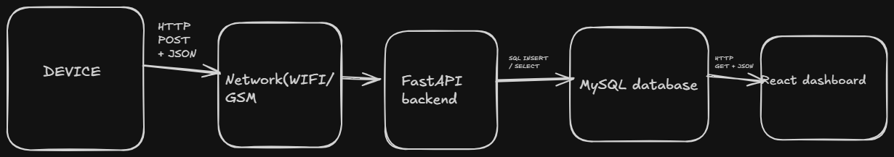
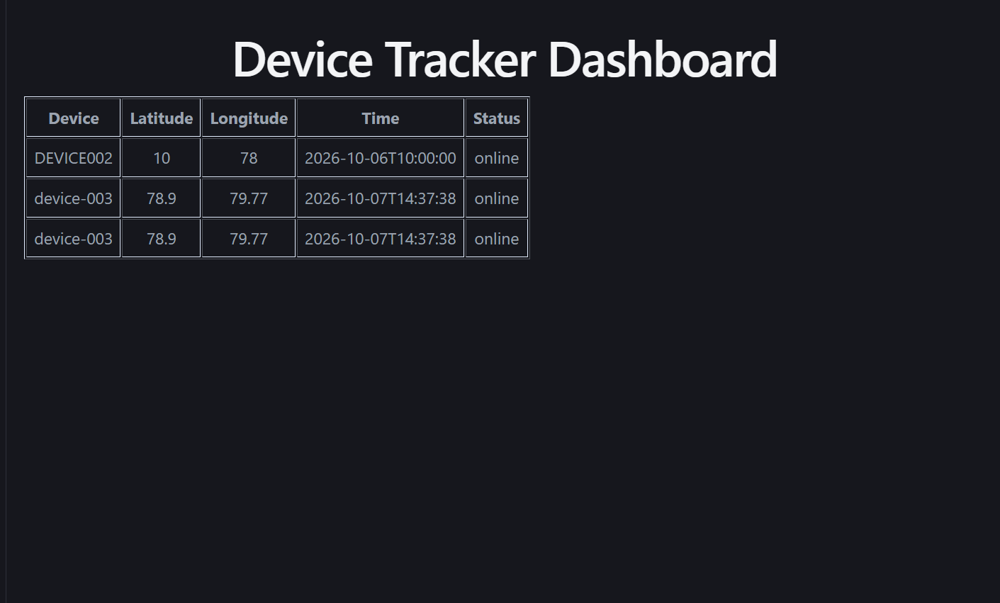

# Device Tracker - Day 1

## What it does
A device sends its location to a REST API. The backend validates it, stores it in MySQL, and a React dashboard displays it.

## System flow


Device -> Network -> FastAPI -> MySQL -> React dashboard

## Tech stack
FastAPI (Python), MySQL, React (Vite), JSON over HTTP

## Setup

### 1. Database
Install MySQL, then run:
```sql
CREATE DATABASE tracker_db;
```

### 2. Backend
```
cd backend
python -m venv venv
venv\Scripts\activate
pip install -r requirements.txt
copy .env.example .env
```
Open `.env` and put your MySQL password in `DB_PASSWORD`. Then:
```
uvicorn main:app --reload
```
API docs: http://localhost:8000/docs

### 3. Frontend
```
cd dashboard
npm install
npm run dev
```
Dashboard: http://localhost:5173

## API endpoints
| Method | URL | Purpose |
|---|---|---|
| POST | /locations | Device sends a location |
| GET | /locations | Get all locations |
| GET | /locations/{device_id}/latest | Latest point for one device |

## Example JSON
```json
{
  "device_id": "DEVICE001",
  "latitude": 10.0,
  "longitude": 78.0,
  "timestamp": "2026-10-06T10:00:00Z",
  "status": "online"
}
```

## Screenshot


## Notes
Concepts, issues faced, and learnings are in [NOTES.md](NOTES.md).
